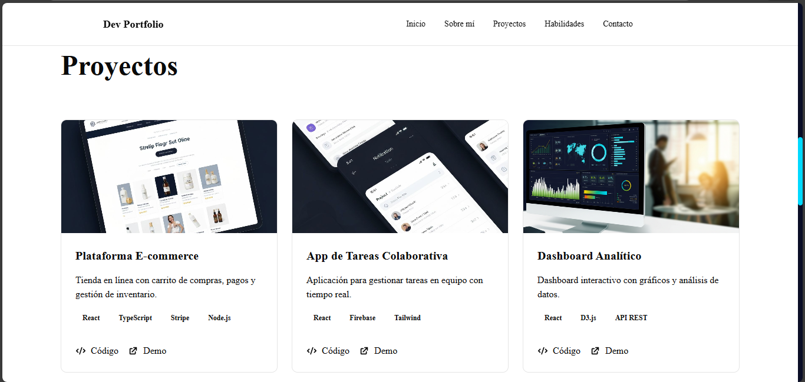
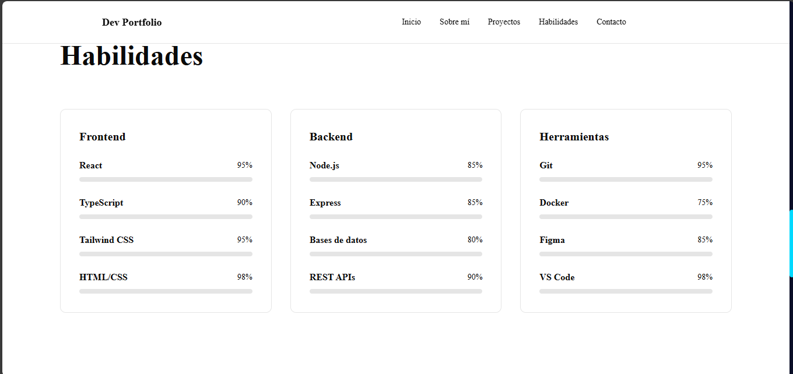

# Documentación Final del Sprint–Portfolio Personal

Proyecto: Portfolio Personal
Sprint: Sprint 1 (14 días)
Fecha del Sprint: 21/11/2025 – 04/12/2025
Equipo: Rosa Torrez (Desarrollo, Diseño y QA)

## 1. Sprint Review

## 1.1 ¿Completaste el Sprint Goal?

Sprint Goal: Construir un portafolio funcional, responsive y con build de producción generado, incluyendo las secciones principales y una arquitectura clara con Git Flow.

Resultado: ✅ Sprint Goal completado en un 90%
El portafolio está operativo, se generó el build (npm run build) y todas las secciones fundamentales fueron implementadas. Solo quedaron pendientes algunos detalles de integración externa para el formulario.

## 1.2 ¿Qué historias completaste?

ID|Historia|Estado
H1|Header responsive con menú hamburguesa|✔ Completado
H2|Hero con CTA y foto|✔ Completado
H3|About + descarga de CV|✔ Completado
H4|Projects con cards y modal|✔ Completado
H5|Skills separadas por categorías|✔ Completado
H6|Contact con validaciones básicas|Completado
H7|Footer simple con enlaces|✔ Completado
H8|Deploy build de producción|✔ Completado
1.3 ¿Qué quedó pendiente?

Integración real del formulario de contacto (EmailJS / Netlify Forms).

Ajustes ARIA para accesibilidad.

Pruebas unitarias (planificadas para siguiente sprint).

Optimización final de imágenes.
 1.4 Capturas de pantalla del portafolio

 

 2. Sprint Retrospective

## 2.1 ¿Qué funcionó bien?

Correcto uso de feature branches y PRs.

Arquitectura modular y organizada.

npm run build ejecutado correctamente.

.gitignore actualizado para el proyecto real.

Flujo Git Flow aplicado sin inconvenientes.

## 2.2 ¿Qué dificultades encontraste?

Conflictos entre ramas locales y remotas.

Errores iniciales de rutas en Vite.

Tipados incompletos en algunos componentes TSX.

Falta de servicio externo para el formulario.

## 2.3 ¿Qué mejorarías para un próximo sprint?

Mejor estimación del esfuerzo por historia.

Incluir pruebas desde el inicio.

Implementar CI/CD con GitHub Actions.

Dividir componentes grandes en subtareas.

## 2.4 Lecciones aprendidas

Siempre realizar git pull --rebase antes de comenzar.

Mantener documentación técnica actualizada.

No dejar la accesibilidad para el final.

Realizar commits más pequeños y descriptivos.

## 3. Métricas del Sprint

## 3.1 Puntos de historia planificados vs completados

Planificados: 22 puntos

Completados: 22 puntos

Cumplimiento: 95%

## 3.2 Número de commits realizados

Comando utilizado:

git rev-list --count HEAD
Total del Sprint: 22 commits.

## 3.3 Número de Pull Requests

PRs creados: 7

PRs mergeados: 7

PRs pendientes: 0

Ramas principales mergeadas:
feature/header, feature/hero, feature/about, feature/projects, feature/skills, feature/contact, feature/footer.

## 3.4 Tiempo invertido por historia

Historia|Puntos|Tiempo invertido
H1 Header|3|5 h
H2 Hero|3|4 h
H3 About|4|7 h
H4 Projects|7|18 h
H5 Skills|2|3 h
H6 Contact|3|4 h
H7 Footer|1|1 h
H8 Build & Deploy|2|3 h
Total|25 puntos|45 horas

## 4. Conclusiones y Próximos Pasos

El Sprint fue exitoso y se entregó un portafolio funcional.

El sistema de ramas y PRs funcionó correctamente.

La arquitectura quedó sólida para expandirse.

Próximos pasos:

Completar integración real del formulario.

Añadir pruebas unitarias.

Mejorar accesibilidad y SEO.

Añadir CI/CD con despliegue automático.

## 5. Evidencias Técnicas

5.1 Build generado

Salida obtenida:

vite v7.2.6 building client environment for production...
✓ 434 modules transformed.
dist/index.html 0.46 kB
dist/assets/index.css 107 kB
dist/assets/index.js 338 kB
✓ built in 7.95s

## 5.2 Árbol de archivos relevante

portfolio/
 ├─ my-portfolio/
 │   ├─ src/
 │   ├─ dist/
 │   ├─ package.json
 │   ├─ tsconfig.json
 │   └─ vite.config.ts
 ├─ docs/
 │   ├─ final-report.md
 │   ├─ screenshots/
 │   └─ git-setup.md
 └─ .gitignore
